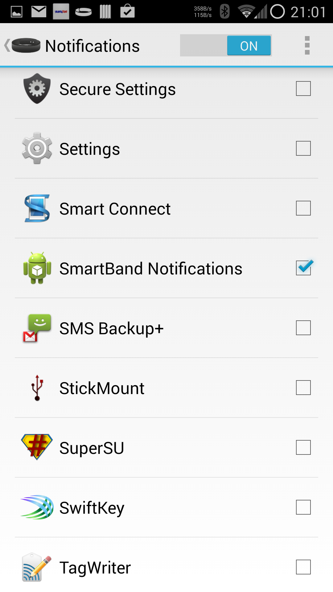
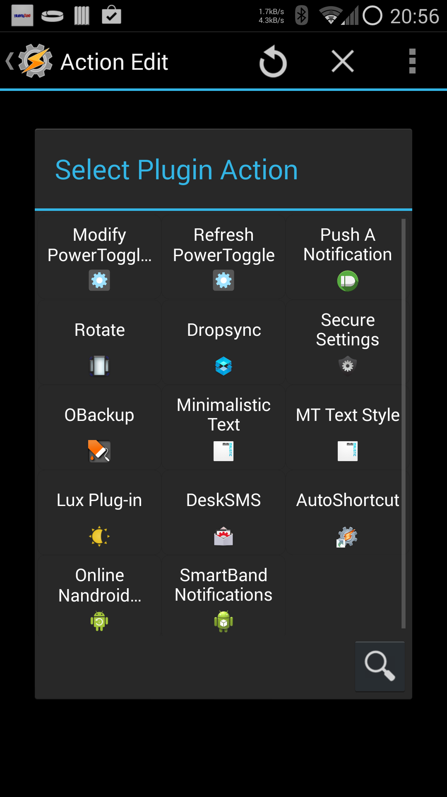
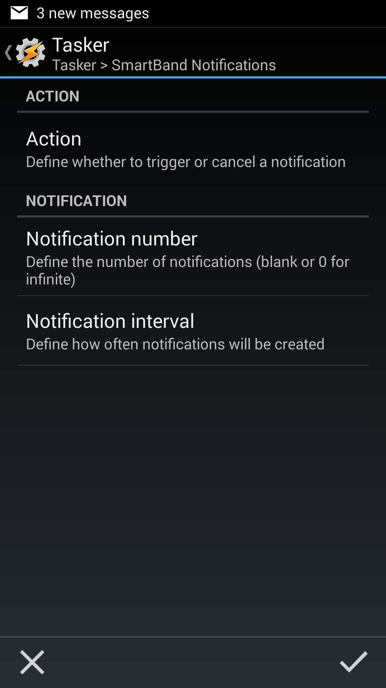
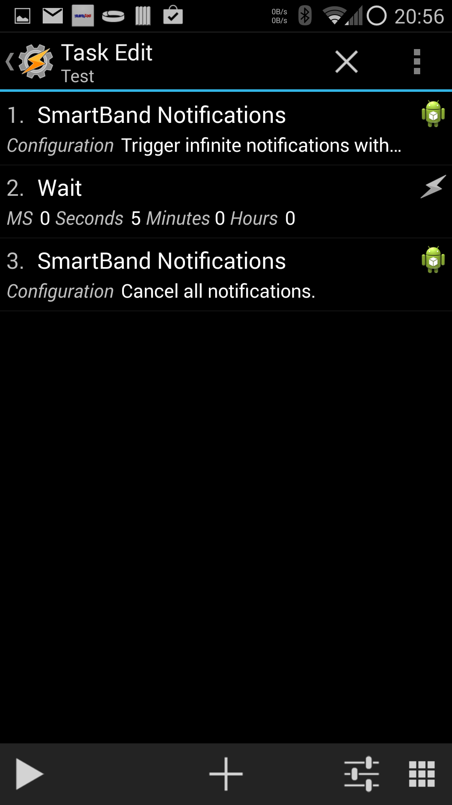

# Smartband Notifications

## Introduction

Tasker plugin that creates a number of notifications over an interval. Used to make the Sony SWR10 SmartBand vibrate.

The plugin outputs a series of notifications with a defined interval between them. The app can be then selected in the SmartBand Notifications configuration so the notifications cause a vibration.

An infinite number of notifications can be generated and notifications can also be cancelled at any point.

Consider this alpha code..

The code is based on the Locale demo plugin so probably would work with anything that can load Locale plugins. Not tested in anything other than Tasker though.

## Installation

- Enable installing apps from unknown sources (See [User Opt-In for Apps from Unknown Sources](http://developer.android.com/distribute/tools/open-distribution.html#unknown-sources)) under Settings > Security
- Browse to [SmartBandNotifications.apk](bin/SmartBandNotifications.apk?raw=true)

## Usage

### Smartband settings notification

To allow the app to vibrate the SmartBand enable notification forwarding in the SmartBand Settings:

- Open SmartConnect
- Open SmartBand 
- Edit Settings
- Tap Notifications to edit the apps that can forward notifications to SmartBand
- Scroll to [SmartBand Notifications](#smartband-settings) and tick

### Trigger notifications

To trigger a notification (make the SmartBand vibrate) create a Tasker Task:

- Open Tasker
- Switch to the Tasks tab
- Add a new Task and enter it
- Add an Action
- Select Plugin > [SmartBand Notifications](#select-plugin)
- [Edit Configuration](#smartband-notifications-settings)
- Set Action to Trigger Notifications
- Set Notification number to number of notifications (vibrates). 
  - Setting 0 will trigger infinite notifications and can be used in combination with [Cancelling notifications](#cancelling-notifications)
- Set Notification interval in milliseconds, the time between vibrations (defaults to 2000 ms or 2 seconds)
- Press the tick on the bottom right to save the configuration. The configuration will be shown on the previous screen.
- Press the arrow next to Action Edit to save the action. The [Action](#tasker-action) will be shown on th previous screen.
- Press the arrow next to Task Edit and exit Tasker to save the task
- You can now trigger this task however you please using on or more profiles (e.g. Alarm Clock)

### Cancelling notifications

To cancel an ongoing notification create a Tasker Task:

- Open Tasker
- Switch to the Tasks tab
- Add a new Task and enter it
- Add an Action
- Select Plugin > SmartBand Notifications
- Edit Configuration
- Set Action to Cancel Notifications
- Press the tick on the bottom right to save the configuration
- Press the arrow next to Action Edit to save the action
- Press the arrow next to Task Edit and exit Tasker to save the task
- You can now trigger this task however you please using on or more profiles (e.g. Alarm Done)

## Screenshots

### Smartband settings

### Select plugin

### Smartband Notifications settings

### Tasker action

